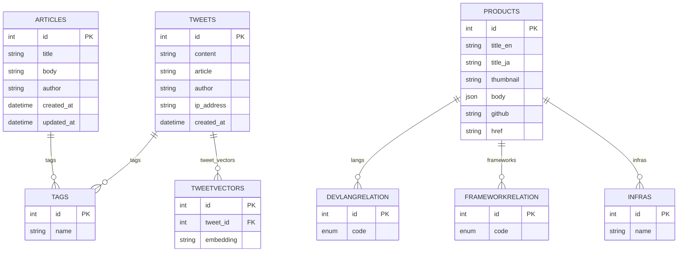

```mermaid
erDiagram
  TWEETS ||--o{ TAGS : "tags"
  TWEETS ||--o{ TWEETVECTORS : "tweet_vectors"
  ARTICLES ||--o{ TAGS : "tags"

  TWEETS {
    int id PK
    string content
    string article
    string author
    string ip_address
    datetime created_at
  }
  TAGS {
    int id PK
    string name
  }
  TWEETVECTORS {
    int id PK
    int tweet_id FK
    string embedding
  }

  ARTICLES {
    int id PK
    string title
    string body
    string author
    datetime created_at
    datetime updated_at
  }

  PRODUCTS ||--o{ DEVLANGRELATION : "langs"
  PRODUCTS ||--o{ FRAMEWORKRELATION : "frameworks"
  PRODUCTS ||--o{ INFRAS : "infras"

  PRODUCTS {
    int id PK
    string title_en
    string title_ja
    string thumbnail
    json body
    string github
    string href
  }
  DEVLANGRELATION {
    int id PK
    enum code
  }
  FRAMEWORKRELATION {
    int id PK
    enum code
  }
  INFRAS {
    int id PK
    string name
  }
```